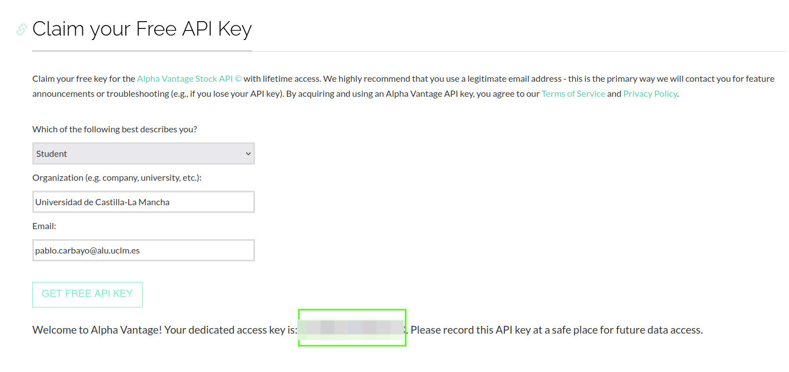
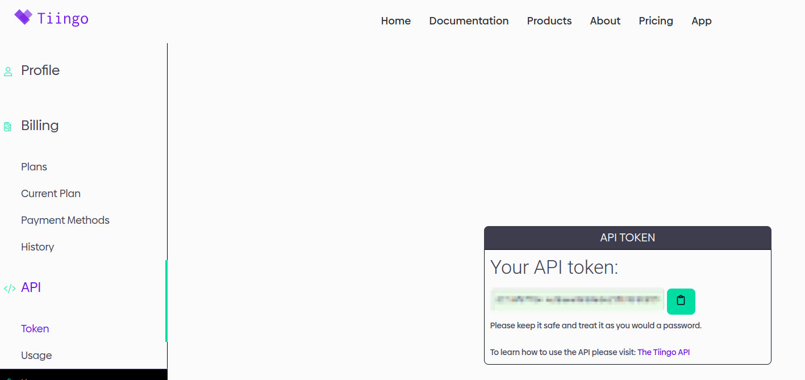

# isi-EFTPro

# Tutorial para ejecutar los test de las APIs
Para obtener los correspondientes tokens de seguridad primero hay que registrarse en las páginas de ambas APIs.

**Alphavantage**: [https://www.alphavantage.co/support/#api-key](URL)

**Tiingo**: [https://www.tiingo.com/](URL)

Una vez estemos registrados y tengamos el token de seguridad, introducimos el token en la variable API_KEY y procedemos a ejectuar los test. Se pueden ejecutar los test de varias maneras: función por función o todas las funciones a la vez.

Como recomendación para tardar menos es ideal comprobar todas las funciones a la vez. Para ello se comprobaría de la siguiente manera: 

    python3 api_a_probar-api-test.py all

## RECOMENDACION
 Crear un entorno virtual para instalar las dependencias (requests, pandas y matplotlib) sin que afecten al entorno global.

# Tutorial para la base de datos
La base de datos etfPro.db está actualmente vacía. Para probarla, se puede ejecutar los test del archivo testDB.sql. Este script inserta datos en las distintas tablas y posteriormente se realizan operaciones sobre ellas.
